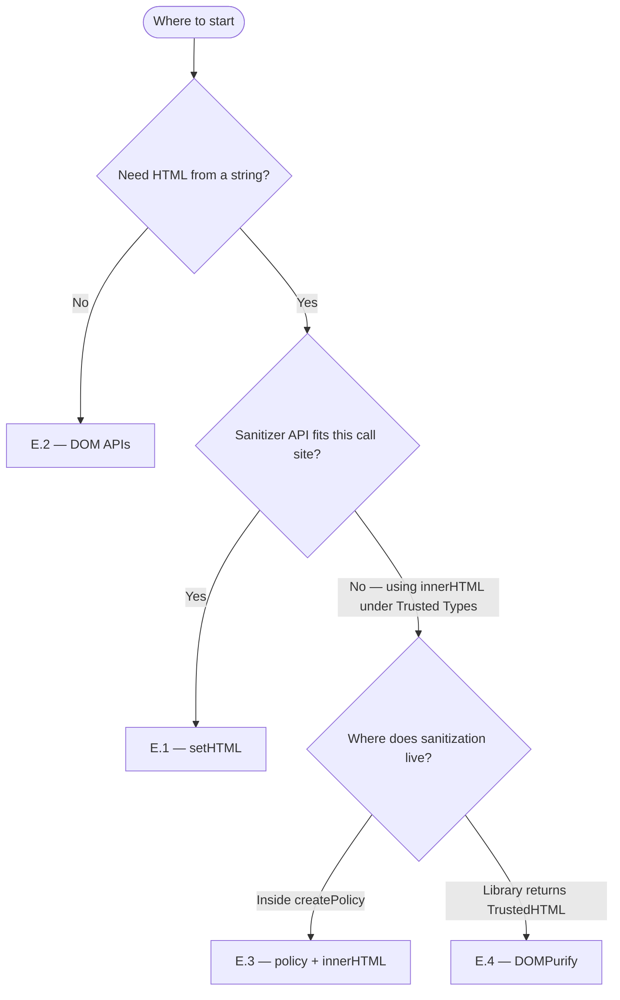
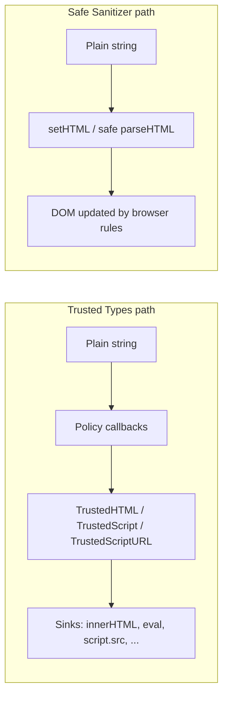

# Trusted Types - Cheatsheet

> **The shift in one breath:** APIs such as **`innerHTML`**, **`eval`**, and **`HTMLScriptElement.src`** are **DOM XSS sinks**: they historically accepted ordinary **strings**, so attacker-controlled string data could become executable behavior. **Trusted Types** enforcement uses **`Content-Security-Policy: require-trusted-types-for 'script'`** together with the **`trusted-types`** directive, which allowlists **`TrustedTypePolicy`** names. Covered sinks must receive **`TrustedHTML`**, **`TrustedScript`**, or **`TrustedScriptURL`** from **`trustedTypes.createPolicy(...)`**, except where the specification routes string input through a registered **`default`** policy. Sanitization and validation therefore live in **`TrustedTypePolicy`** callbacks, and which policies may run is **declared in CSP** rather than implied by scattered call sites. Separately, the **HTML Sanitizer API** (**`setHTML()`**, **`Document.parseHTML()`**, …) provides insertion paths where the engine applies its own rules; **`trusted-types 'none'`** (“**Perfect Types**”) forbids registering policies and relies on those Sanitizer paths for vetted HTML.


## How this file is organized

| Section | What you will find |
|---------|-------------------|
| [A. HTTP / CSP](#cat-a) | Example **Content-Security-Policy** headers: try in report-only mode first, then enforce; includes “Perfect Types” |
| [About `DOMPurify` in examples](#about-sanitizers-in-examples) | Why DOMPurify appears often; native **`setHTML()`** / other sanitizers |
| [B. Policies & `TrustedHTML`](#cat-b) | The three trusted types, the basic **createPolicy → innerHTML** flow, optional feature-detect, escape-only policy |
| [C. Default policy (migration)](#cat-c) | The special **`default`** policy name for gradual migration |
| [D. What breaks under enforcement](#cat-d) | Code that throws; building a `<script>` in a tricky way |
| [E. Safe ways to put HTML on the page](#cat-e) | **Pick one** approach per place in your code: `setHTML()`, DOM APIs, policy, or DOMPurify |
| [F. Sanitizer API + Trusted Types](#cat-f) | Safe vs less-safe Sanitizer methods; how that fits together with Trusted Types |
| [G. Seeing violations in the browser](#cat-g) | Logging CSP / Trusted Types problems |
| [H. Tiny polyfill (old browsers)](#cat-h) | A few lines so `createPolicy` exists without native support; details in **`POLYFILL.md`** |
| [Live demos (`playground/`)](playground/README.md) | Split view leads with **§ A.3** **`setHTML()`** + Perfect Types vs vulnerable **`innerHTML`** / **`eval`**; **§ A.2** in **policy lab**; **`node playground/serve.mjs`**; **DevTools → Console** for **`log()`** |

---

<a id="cat-a"></a>

## A. HTTP / Content-Security-Policy

**Tip:** Start with headers that only **report** problems. When nothing important breaks, switch to headers that **enforce** rules. Always send CSP from your **server** for browsers that support Trusted Types natively.

### A.1 Report-only — log issues, do not block yet

The browser records violations (for example string assigned to `innerHTML`) but the page keeps working.

```http
Content-Security-Policy-Report-Only: require-trusted-types-for 'script'; report-uri https://my-csp-endpoint.example/
```

If you use the Reporting API, you can use `report-to` instead of `report-uri`. The Trusted Types part is always **`require-trusted-types-for 'script'`**.

### A.2 Enforce — and list which policy names you allow

You list allowed policy names in **`trusted-types`**. Only those names may be passed to `trustedTypes.createPolicy()`:

```http
Content-Security-Policy: require-trusted-types-for 'script'; trusted-types myPolicy
```

You can add **`report-uri`** (or **`report-to`**) on the enforcing header too, so you still get logs after you turn blocking on.

```http
Content-Security-Policy: require-trusted-types-for 'script'; trusted-types myPolicy; report-uri https://my-csp-endpoint.example/
```

### A.3 “Perfect Types” — no policies; use the Sanitizer API instead

Here you **forbid** creating any Trusted Types policy (`trusted-types 'none'`). Legacy string APIs such as `innerHTML = "..."` cannot be used in the usual way. You insert HTML with **`setHTML()`** or parse with **`Document.parseHTML()`** instead.

```http
Content-Security-Policy: require-trusted-types-for 'script'; trusted-types 'none'
```

Worked examples: [§ E.1 `setHTML()`](#e-1-sethtml) and [§ F.4 `Document.parseHTML()`](#f-4-documentparsehtml).

---

<a id="about-sanitizers-in-examples"></a>

### About `DOMPurify` in the examples (it is optional)

Many snippets call **`DOMPurify.sanitize(...)`** because upstream docs use it as a well-known stand-in for “**turn untrusted HTML into something safer before it hits a sink**.” **You do not have to use DOMPurify.**

Inside **`createHTML`** (and friends), the body can be **any** approach you trust and can review, for example:

- **Native HTML Sanitizer API** — often you can skip `innerHTML` entirely and use **`element.setHTML(...)`** or **`Document.parseHTML(...)`** so the browser applies its own XSS-safe rules (see **[§ E.1](#e-1-sethtml)** and **[§ F](#cat-f)**).
- **Another sanitizer library**, or **code you wrote yourself**, as long as the rules are clear and maintained.
- **Strict escaping** when you only need **plain text**, not rich HTML.

**Trusted Types do not pick the sanitizer**—they only require that data passes through **your** policy (or through APIs like **`setHTML()`** that enforce safety differently). Pick one strategy per call site and stick to it.

---

<a id="cat-b"></a>

## B. Policies & `TrustedHTML`

A **policy** is a small object you create once. Its methods (like **`createHTML`**) turn a string into a **trusted value** the browser accepts on “dangerous” APIs. Below is the usual introduction to policies and sinks.

<a id="b-1-mdn-trusted-types-api"></a>

### B.1 The three trusted types + a minimal example

Browsers group dangerous APIs into a few kinds. Each kind has a matching **trusted type**. A **sink** is one of those APIs: without Trusted Types, a **string** you pass in might be unsafe.

| Type | Typical sinks (examples) | In plain terms |
|------|---------------------------|----------------|
| **`TrustedHTML`** | `innerHTML`, `outerHTML`, `insertAdjacentHTML`, `document.write`, `document.writeln`, `DOMParser.parseFromString`, iframe `srcdoc`, … | The browser treats the value as **HTML** to parse or insert. |
| **`TrustedScript`** | `eval`, inline **`<script>`** text, `new Function`, `setTimeout` / `setInterval` with a **string** body, … | The browser treats the value as **JavaScript** to run. |
| **`TrustedScriptURL`** | `HTMLScriptElement.src`, and other properties that take a **URL to a script**, … | The browser treats the value as a **script URL** to fetch or follow. |

Your policy implements **`createHTML`**, **`createScript`**, and/or **`createScriptURL`** depending on which sinks your code uses.

**Minimal flow:** create a policy → wrap the string → assign the trusted value. The **`createHTML`** callback can use **any** sanitizer you choose (here: DOMPurify — see **[About `DOMPurify`](#about-sanitizers-in-examples)**):

```js
const policy = trustedTypes.createPolicy("my-policy", {
  createHTML: (input) => DOMPurify.sanitize(input),
});

const userInput = "<p>I might be XSS</p>";
const element = document.querySelector("#container");
const trustedHTML = policy.createHTML(userInput);
element.innerHTML = trustedHTML;
```

If your CSP includes **`trusted-types my-policy`**, the name you pass to **`createPolicy`** must be **`my-policy`** (same string).

<a id="b-2-register-feature-detect"></a>

### B.2 Same as B.1, but only if the browser supports Trusted Types

On very old browsers, **`trustedTypes`** may be missing. This avoids a hard error before you register the policy:

```js
if (window.trustedTypes && trustedTypes.createPolicy) {
  const policy = trustedTypes.createPolicy("myPolicy", {
    createHTML: (input) => DOMPurify.sanitize(input),
  });
  // use: element.innerHTML = policy.createHTML(userHtml);
}
```

The CSP **`trusted-types`** list must include **`myPolicy`** if you use that name.

<a id="b-3-escape-only"></a>

### B.3 Escape-only policy (good for plain text, not rich HTML)

This only escapes special characters. It is **not** a full sanitizer for rich HTML. Use DOMPurify or **`setHTML()`** when users can pass real markup (escape-only example):

```js
const escapeHTMLPolicy = trustedTypes.createPolicy("myEscapePolicy", {
  createHTML: (string) =>
    string
      .replace(/&/g, "&amp;")
      .replace(/</g, "&lt;")
      .replace(/"/g, "&quot;")
      .replace(/'/g, "&#39;"),
});

const el = document.getElementById("myDiv");
const escaped = escapeHTMLPolicy.createHTML('');
el.innerHTML = escaped;
```

---

<a id="cat-c"></a>

## C. Default policy (migration)

If you **cannot** change every call site yet (for example third-party code still does `innerHTML = x`), register a policy whose name is exactly **`default`**. The browser may send string assignments through that policy.

### C.1 Default policy that runs DOMPurify

```js
if (window.trustedTypes && trustedTypes.createPolicy) {
  trustedTypes.createPolicy("default", {
    createHTML: (string, sink) =>
      DOMPurify.sanitize(string, { RETURN_TRUSTED_TYPE: true }),
  });
}
```

For **your own** code, prefer a **named** policy at each call site so rules stay easy to find.

### C.2 Default policy that always fails (finds leftover string uses)

Useful while refactoring: any string that hits a sink **throws** after logging:

```js
trustedTypes.createPolicy("default", {
  createHTML(value) {
    console.warn("Refactor: string reached innerHTML", value?.slice?.(0, 80));
    return null; // sink assignment throws TypeError
  },
});
```

---

<a id="cat-d"></a>

## D. What breaks under enforcement

A **sink** is a browser API that can turn a string into running script or unsafe HTML (for example **`innerHTML`**).

### D.1 Assigning a plain string to `innerHTML`

With **`require-trusted-types-for 'script'`** enforced and **no** usable **`default`** policy, this throws **`TypeError`**:

```js
const userInput = "<p>I might be XSS</p>";
const element = document.querySelector("#container");
element.innerHTML = userInput; // TypeError when Trusted Types are enforced and no default policy fixes it
```

### D.2 Building a `<script>` via DOM nodes (still security-sensitive)

You never assigned to `innerHTML`, but you can still end up running script. The browser may apply Trusted Types when the script is about to run:

```js
const untrustedString =
  "console.log('A potentially malicious script from an untrusted source!');";
const textNode = document.createTextNode(untrustedString);
const script = document.createElement("script");
script.appendChild(textNode);
document.body.appendChild(script); // under enforcement: may need TrustedScript or a default policy
```

---

<a id="cat-e"></a>

## E. Safe ways to put HTML on the page

You usually want **one** clear pattern per place in your code: either the browser’s **Sanitizer** path, **DOM** construction without HTML strings, your own **Trusted Types policy**, or **DOMPurify** returning a trusted value.



| § | Approach | Idea in one line | Good when… |
|---|----------|----------------|-------------|
| [E.1](#e-1-sethtml) | **`setHTML()`** | Browser parses HTML and drops unsafe parts | You can rely on the **HTML Sanitizer API**; fits **Perfect Types** (`trusted-types 'none'`) |
| [E.2](#e-2-dom-apis) | **DOM APIs** | Build nodes with `createElement`, `textContent`, … | You do **not** need a chunk of HTML as text |
| [E.3](#e-3-policy-innerhtml) | **Policy + `innerHTML`** | You wrap strings in `policy.createHTML(...)` | You use **Trusted Types + CSP** and want full control in one policy |
| [E.4](#e-4-dompurify-trusted-type) | **DOMPurify** | Library outputs a `TrustedHTML` you assign directly | DOMPurify is already your sanitizer |

<a id="e-1-sethtml"></a>

### E.1 `element.setHTML(...)` — browser-owned sanitizing

Good when you have an HTML string from an untrusted source and the browser supports the **HTML Sanitizer API**:

```js
const untrustedString = "abc <script>alert(1)</script> def";
const target = document.getElementById("target");
target.setHTML(untrustedString);
```

This path does **not** use your `trustedTypes.createPolicy` code—the browser runs its own safe rules. List of safe methods and how this interacts with Trusted Types: [§ F.1–F.3](#cat-f).

<a id="e-2-dom-apis"></a>

### E.2 Build the DOM without an HTML string

Often the safest option when you only need structure:

```js
el.textContent = "";
const img = document.createElement("img");
img.src = "xyz.jpg";
el.appendChild(img);
```

Avoid:

```js
el.innerHTML = "";
```

<a id="e-3-policy-innerhtml"></a>

### E.3 Your policy + `innerHTML`

Same steps as [§ B.1](#b-1-mdn-trusted-types-api). Use this when you are **not** using **`setHTML()`** but you do use **`innerHTML`** with Trusted Types:

```js
const policy = trustedTypes.createPolicy("myPolicy", {
  createHTML: (input) => DOMPurify.sanitize(input),
});
element.innerHTML = policy.createHTML(userHtml);
```

<a id="e-4-dompurify-trusted-type"></a>

### E.4 DOMPurify returns `TrustedHTML` for you

When the library is configured to output a trusted value:

```js
import DOMPurify from "dompurify";

el.innerHTML = DOMPurify.sanitize(html, { RETURN_TRUSTED_TYPE: true });
```

If Trusted Types are **enforced**, the value must be a real **`TrustedHTML`** (or your **default** policy must accept the flow). E.3 keeps sanitizing rules **inside your policy**. E.4 keeps them **inside DOMPurify**—pick the style that matches how your app is structured.

---

<a id="cat-f"></a>

## F. HTML Sanitizer API & Trusted Types

Short reference for the **HTML Sanitizer API**.

<a id="f-1-safe-methods"></a>

### F.1 “Safe” methods — browser always removes XSS-level danger

These APIs take an HTML string (and optionally a **`Sanitizer`** config). **Unsafe tags and attributes are always removed**, even if your custom config would allow them. If you pass **no** custom sanitizer, the browser uses its **default** rules (stricter than the bare minimum—for example comments and `data-*` are often removed).

| Method | Where it runs |
|--------|----------------|
| **`Element.setHTML()`** | On a normal element |
| **`ShadowRoot.setHTML()`** | Inside a shadow root |
| **`Document.parseHTML()`** | Returns a **new temporary `Document`** so you can parse HTML off the live page, then copy nodes over |

Prefer these over **`innerHTML = string`** for **untrusted** HTML when the browser supports them.

<a id="f-2-unsafe-methods"></a>

### F.2 “Unsafe” methods — you accept more risk

They follow **your** sanitizer config only. With **no** config they behave closer to permissive **`innerHTML`**. Only use them when you truly need something the safe APIs strip—and treat the result as **still potentially dangerous**, just narrower than raw HTML.

This naming echoes a pattern front-end stacks have used for a long time: **opt-in APIs whose names scream “higher risk”** so they stand out in code review—think **React’s** `dangerouslySetInnerHTML`, or **Angular’s** explicit sanitizer bypasses (`bypassSecurityTrustHtml`, …). A decade or so later, **browsers** adopted the same idea with **`setHTMLUnsafe` / `parseHTMLUnsafe`**: the safe path is the default; the **`Unsafe`** variant is deliberate.

| Method | Where it runs |
|--------|----------------|
| **`Element.setHTMLUnsafe()`** | On a normal element |
| **`ShadowRoot.setHTMLUnsafe()`** | Inside a shadow root |
| **`Document.parseHTMLUnsafe()`** | Returns a **`Document`** from your string with your rules |

<a id="f-3-sanitizer-plus-trusted-types"></a>

### F.3 Using Sanitizer API and Trusted Types together

Both help prevent **DOM XSS**, but they work differently:

| | **Trusted Types** | **Sanitizer “safe” methods** |
|--|-------------------|------------------------------|
| **Idea** | CSP tells the browser: on certain APIs, only accept **trusted values** (or send strings through a **default** policy). You write the **policy** code (or call a library from it). | The browser **parses** your HTML and **removes** dangerous pieces before insert. You do **not** go through `createPolicy` for the baseline XSS cuts. |
| **Who decides “safe enough”?** | **You** (your policy / sanitizer you call). | **The browser** for the built-in safe path (you can still pass extra sanitizer options). |



**When both exist on the page:**

1. **`setHTML()` / safe `parseHTML()`** — The dangerous parts are removed **inside the browser** before insert. That is **separate** from “create `TrustedHTML` in my policy and assign it to `innerHTML`”.
2. **`setHTMLUnsafe()` / …`** — Can still be dangerous depending on config. They can take either a **string** or a **trusted** value. If Trusted Types apply, **your Trusted Types step runs first**, then the sanitizer.
3. **CSP still wins overall.** Example: with **`trusted-types 'none'`** (“Perfect Types”) you cannot mint policies; safe Sanitizer methods are how you still get vetted HTML in.
4. **Using both is fine:** Trusted Types can lock down **old** patterns (`innerHTML`, …), while **safe** Sanitizer calls give a **built-in** HTML path that always does baseline XSS cleanup.

**Always removed on “safe” methods (short list):** `script`, `iframe`, `object`, `embed`, …, and **event handler attributes** like `onclick`. See the **HTML Sanitizer API** docs for the full list.

<a id="f-4-documentparsehtml"></a>

### F.4 `Document.parseHTML()` — parse in a temp document, then copy nodes

Useful with **Perfect Types**: you get a separate document, pick nodes, attach with `appendChild` / `cloneNode`:

```js
const html = "<p>Hello</p><script>bad()<" + "/script>";
const parsed = Document.parseHTML(html);
const safeBit = parsed.querySelector("p");
if (safeBit) {
  document.body.appendChild(safeBit.cloneNode(true));
}
```

For current browser support, see **`Document.parseHTML()`**.

<a id="f-5-sethtmlunsafe"></a>

### F.5 `setHTMLUnsafe` — only if you really need it

**Where “custom config” lives:** `setHTMLUnsafe(input, options)` is documented on MDN as [`Element.setHTMLUnsafe()`](https://developer.mozilla.org/en-US/docs/Web/API/Element/setHTMLUnsafe). The optional **`options.sanitizer`** may be a live **[`Sanitizer`](https://developer.mozilla.org/en-US/docs/Web/API/Sanitizer)** instance, a plain **[`SanitizerConfig`](https://developer.mozilla.org/en-US/docs/Web/API/SanitizerConfig)** dictionary (allow / remove lists for **elements**, **attributes**, **comments**, **`data-*`**, …), or the string **`"default"`** for the browser’s built-in safe baseline. For a **`Sanitizer`** object, start from **[`new Sanitizer(options)`](https://developer.mozilla.org/en-US/docs/Web/API/Sanitizer/Sanitizer)** and optionally tune with **`allowAttribute()`**, **`removeAttribute()`**, **`allowElement()`**, **`removeElement()`**, and related methods. This cheatsheet does not duplicate the full matrix—**`Unsafe`** plus custom lists is a code-review hotspot, so use MDN (and the default configuration page linked from there) as the canonical reference for what your rules still permit.

Same API family as **`setHTML()`** in [§ E.1](#e-1-sethtml). Example: you widen the config (still risky):

```js
const sanitizer = new Sanitizer();
sanitizer.allowAttribute("onblur");
someElement.setHTMLUnsafe(untrustedString, { sanitizer });
```

Allow-list elements but still “unsafe” API:

```js
const sanitizer = new Sanitizer({ elements: ["p", "b", "div"] });
someElement.setHTMLUnsafe(untrustedString, { sanitizer });
```

Prefer **[§ E.1 `setHTML()`](#e-1-sethtml)** unless you have a rare need for **`Unsafe`**. How that interacts with Trusted Types: **[§ F.3](#f-3-sanitizer-plus-trusted-types)**.

---

<a id="cat-g"></a>

## G. Seeing violations in the browser

So you can debug or send reports to your backend while testing:

```js
const observer = new ReportingObserver((reports) => {
  for (const report of reports) {
    if (report.type !== "csp-violation") continue;
    if (report.body.effectiveDirective !== "require-trusted-types-for") continue;
    console.warn("Trusted Types violation:", report.body);
  }
}, { buffered: true });
observer.observe();
```

Simpler catch-all for any CSP violation:

```js
document.addEventListener("securitypolicyviolation", (e) => {
  console.error(e.violatedDirective, e.blockedURI, e.sample);
});
```

---

<a id="cat-h"></a>

## H. Tiny “polyfill” for old browsers (tinyfill)

A few lines so **`trustedTypes.createPolicy`** exists when the browser has **no** native API. It does **not** add real CSP enforcement—it only helps your code run and still call your sanitizer:

```js
if (typeof trustedTypes === "undefined") {
  globalThis.trustedTypes = { createPolicy: (_name, rules) => rules };
}
```

Always test with **real** Trusted Types **enforcement** in a current browser too. Longer explanation: **`POLYFILL.md`**.

---

## Links & Resources

### Official documentation 

- W3C — Trusted Types (spec, incl. pre-navigation / `javascript:`): `https://w3c.github.io/trusted-types/dist/spec/`
- MDN — Trusted Types API: `https://developer.mozilla.org/en-US/docs/Web/API/Trusted_Types_API`
- MDN — HTML Sanitizer API: `https://developer.mozilla.org/en-US/docs/Web/API/HTML_Sanitizer_API`
- MDN — Default sanitizer configuration: `https://developer.mozilla.org/en-US/docs/Web/API/HTML_Sanitizer_API/Default_sanitizer_configuration`
- MDN — `Sanitizer` constructor (configuration dictionary): `https://developer.mozilla.org/en-US/docs/Web/API/Sanitizer/Sanitizer`
- MDN — `SanitizerConfig`: `https://developer.mozilla.org/en-US/docs/Web/API/SanitizerConfig`
- MDN — `Element.setHTMLUnsafe()`: `https://developer.mozilla.org/en-US/docs/Web/API/Element/setHTMLUnsafe`
- MDN — `Document.parseHTML()`: `https://developer.mozilla.org/en-US/docs/Web/API/Document/parseHTML_static`
- web.dev — Trusted Types: `https://web.dev/articles/trusted-types`
- Frederik Braun — Perfect types with `setHTML()`: `https://frederikbraun.de/perfect-types-with-sethtml.html`

### Other files in this repository

- `POLYFILL.md` — polyfill variants, npm, CDN script examples
- `playground/` — **`index.html`** leads with **§ A.3** + **`setHTML()`** vs vulnerable; **policy lab** links **§ A.2** `myPolicy`; **`playground/README.md`**
