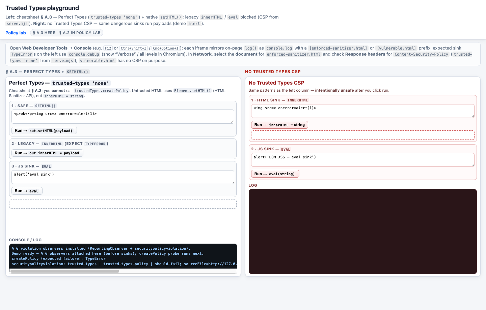

# Trusted Types - Playground

Local **DOM XSS** vs **Trusted Types** demos aligned with the main cheatsheet (**`README.md` § A.2**, **§ A.3**, **§ B**, **§ E.1**): no third-party sanitizers — the **split view** leads with **§ A.3** (**Perfect Types** + **`Element.setHTML()`**); **§ A.2** named policy is one click away in **`policy-lab.html`**.

## Run it (use HTTP, not `file://`)

```bash
node playground/serve.mjs
```

Open **http://127.0.0.1:5190/** in a current browser. For **`frames/enforced-sanitizer.html`** / **`setHTML()`**, use a build with the **HTML Sanitizer API** (Chromium-style browsers are the usual choice).

## Screenshot

**`index.html`** (split view: **§ A.3** **`frames/enforced-sanitizer.html`** vs **no CSP** **`frames/vulnerable.html`**) after starting the server on the default port:



**Developer Tools:** Open the **Console** (e.g. **F12** or **Ctrl+Shift+I** / **Cmd+Option+I**). On-page `log()` lines mirror as `console.log` with a **`[…]`** filename prefix. On **enforced** pages (`frames/enforced.html`, `frames/enforced-sanitizer.html`), expected sink **`TypeError`**s use **`console.debug`** (in Chromium, enable **Verbose** to see them next to § G **`console.log`** lines).

**Reporting / CSP (cheatsheet § G):** **`violation-observe.js`** is loaded only by **`frames/enforced.html`** and **`frames/enforced-sanitizer.html`** (the only HTML responses that include a **`Content-Security-Policy`** with Trusted Types from **`serve.mjs`**). **`createPlaygroundViolationAwareLog(scope)`** attaches **`ReportingObserver`** + **`securitypolicyviolation`** on the first **`log()`** call (plus the one-line “observers installed” message). **`frames/vulnerable.html`** does **not** load it: **`serve.mjs`** sends **no** CSP header for that file, so there is no **`require-trusted-types-for`** enforcement to report — it uses a plain **`log()`** only. On enforced pages, expected **`TypeError`**s from **`innerHTML`** / **`eval`** go to **`console.debug`** only; the on-page log is meant to show policy hooks + § G lines. Before those sinks, **`setPlaygroundSinkContext(...)`** adds **`sink: …`** (element + parent) when the browser emits a violation line; **`securitypolicyviolation`** may also include **`sourceFile`** / **`line`** / **`document`** / **`event.target`** when exposed (varies by browser).

### What actually enforces Trusted Types here

For a frontend developer, the important detail is **which document** is governed by CSP:

- **`serve.mjs`** adds a real **`Content-Security-Policy` HTTP response header** (not a `<meta http-equiv>` tag) only for **`frames/enforced.html`** and **`frames/enforced-sanitizer.html`**. Open **Network** → click the **document** request for that URL → **Headers** → **Response headers** and compare `Content-Security-Policy` to the strings in **`serve.mjs`** (`CSP_STRICT` vs `CSP_PERFECT_TYPES`).
- **`frames/vulnerable.html`**, **`index.html`**, and **`policy-lab.html`** are served **without** that header on purpose, so the “unsafe” side stays unsafe.
- **Trusted Types apply per browsing context (document).** The split view loads two separate iframes; enforcement in the left iframe does not change the right iframe’s document.

## What’s inside

| File | Purpose |
|------|---------|
| **`index.html`** | Two iframes: **§ A.3** (`frames/enforced-sanitizer.html` — **`setHTML()`** + blocked **`innerHTML`** / **`eval`**) vs **`frames/vulnerable.html`** (unrestricted same sinks) |
| **`frames/enforced.html`** | **§ A.2** CSP + **`myPolicy`**: **`setHTML()`** works on the same page while **`createHTML`** / **`createScript`** reject legacy **`innerHTML`** / **`eval`** strings (lab returns **`null`**) |
| **`frames/enforced-sanitizer.html`** | **§ A.3** Perfect Types: `trusted-types 'none'` — **`setHTML()`** for safe insert; **`innerHTML`** / **`eval`** blocked; **`createPolicy`** fails by design |
| **`frames/vulnerable.html`** | No TT CSP — payloads run after **Run** (demo **`alert`**) |
| **`policy-lab.html`** | Links **A.2** vs **A.3** demos |
| **`index.css`**, **`policy-lab.css`** | Stylesheets for **`index.html`** / **`policy-lab.html`** at playground root |
| **`frames/enforced.css`**, **`frames/enforced-sanitizer.css`**, **`frames/vulnerable.css`** | Styles next to their **`frames/*.html`** demos; **`frames/*.html`** still load **`../violation-observe.js`** where used |
| **`violation-observe.js`** | **§ G** — used by **`frames/enforced*.html`** only; **`frames/vulnerable.html`** uses a plain inline **`log()`** (no TT violations to observe) |
| **`serve.mjs`** | Injects real **`Content-Security-Policy`** headers on **`frames/enforced.html`** and **`frames/enforced-sanitizer.html`**; serves **`.css`** with **`text/css`** |

**CSP note:** `script-src 'unsafe-inline'` is only so demo scripts work locally; `style-src 'self' 'unsafe-inline'` allows those **`.css`** files under `default-src 'none'` — **do not** copy blindly to production.

**Warning:** **`frames/vulnerable.html`** is intentionally XSS-capable. Do not expose this directory on the public internet.
